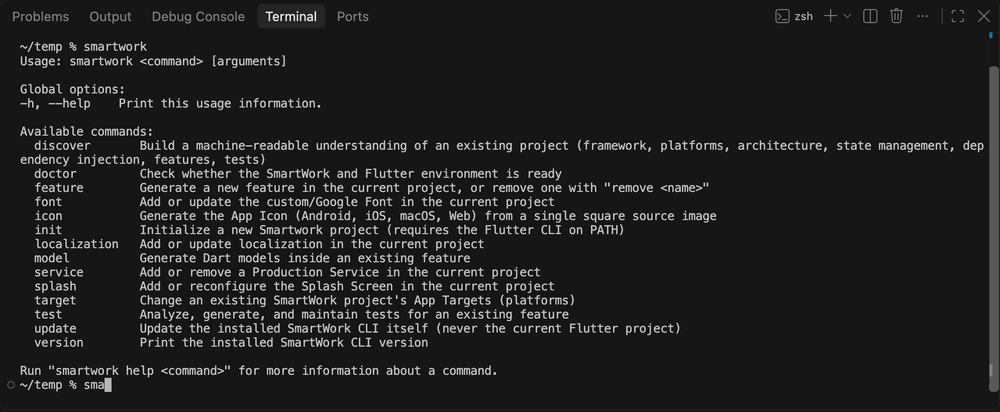

# SmartWork

> "Don't read success stories, you will only get a message. Read
> failure stories, you will get some ideas to get access."
> — APJ Abdul Kalam

[](https://pub.dev/packages/smartwork_cli)
[](LICENSE)

**The all-in-one Flutter project companion** — init, architect, scaffold,
test, and ship, without leaving the terminal.

SmartWork is a single toolkit that takes a Flutter project from zero to
production-ready and keeps it that way: one command to bootstrap a real
Flutter app with a consistent architecture, one command each to grow it
with features, services, targets, fonts, and localization, and one
command to verify it's still healthy. No boilerplate copy-pasting, no
drifting conventions between features, no guesswork on what "done"
looks like. It ships two ways to use it:

- **`smartwork` (CLI)** — an interactive terminal tool that bootstraps
  a real Flutter project and scaffolds features, services, and
  platform targets into it.
- **SmartWork MCP** — a Model Context Protocol server that exposes the
  same operations as structured tools for MCP-compatible AI clients.

Both talk to the same underlying engine, so a project you build with
the CLI behaves identically to one built through an AI client using
MCP.

> **Publishing status:** `smartwork_cli` is distributed through
> [pub.dev](https://pub.dev/packages/smartwork_cli). `smartwork_mcp`
> is not yet published — see [SmartWork MCP](docs/mcp.md) for
> installing it from source.

## Demo



## Quick Start

```bash
# 1. Install
dart pub global activate smartwork_cli
```

This installs a `smartwork` executable on your machine. Make sure Dart's
global bin directory is on your `PATH`:

```bash
# macOS/Linux (add to ~/.zshrc, ~/.bashrc, etc.)
export PATH="$PATH:$HOME/.pub-cache/bin"
```

```powershell
# Windows (PowerShell)
$env:Path += ";$env:LOCALAPPDATA\Pub\Cache\bin"
```

On macOS, the default shell is zsh, so this usually means adding that line
to `~/.zshrc`. To open and edit it:

```bash
open -e ~/.zshrc   # opens in TextEdit
code ~/.zshrc      # opens in VS Code (if the `code` CLI is installed)
nano ~/.zshrc      # edit directly in the terminal
```

After saving, reload it in your current terminal with `source ~/.zshrc`, or
just open a new terminal window.

```bash
# 2. Create a project
smartwork init

# 3. Add a feature and a service
smartwork feature profile
smartwork service add analytics

# 4. Confirm everything is healthy
smartwork doctor
```

See [Getting Started](docs/getting-started.md) for full requirements,
Flutter SDK setup (including FVM), and installation details.

## Commands

| Command | What it does |
| --- | --- |
| `smartwork init` | Bootstraps a real Flutter project (`flutter create`) and applies architecture, state management, network, storage, fonts, localization, and Production Services on top of it |
| `smartwork feature <name>` | Generates a new feature; `smartwork feature remove <name>` deletes one |
| `smartwork service add\|remove <name>` | Adds or removes a Production Service (analytics, notifications, secure session, remote config, ...) |
| `smartwork target` | Changes an existing project's App Targets (Android/iOS/Web/Windows/macOS/Linux) |
| `smartwork font` | Adds or updates the Custom/Google Font on an existing project |
| `smartwork localization` | Adds or updates localization (supported locales, default locale) on an existing project |
| `smartwork model from-json` | Generates a Dart model (fields, `fromJson`/`toJson`) from a JSON sample, inside an existing feature |
| `smartwork icon` | Generates the App Icon (Android, iOS, macOS, Web) from one square source image |
| `smartwork splash` | Adds or reconfigures the Splash Screen (background color + icon) |
| `smartwork discover` | Read-only analysis of any existing Flutter project — architecture, state management, dependencies, test coverage |
| `smartwork doctor` | Checks whether the SmartWork/Flutter environment and current project are healthy |
| `smartwork test` | Analyzes, generates, and maintains tests for an existing feature (Test Automation and Test Maintenance) |
| `smartwork update` | Updates the installed SmartWork CLI itself (never the current Flutter project) |
| `smartwork version` | Prints the installed SmartWork CLI version |

Every command has `--help`, e.g. `smartwork feature --help`.

## Capabilities

### Project Generation

`smartwork init` bootstraps a real Flutter project and applies a
consistent architecture, state management, network, and storage
foundation. `smartwork feature`/`service`/`target`/`font`/
`localization` then grow it incrementally, and `smartwork model`/
`icon`/`splash` add focused, one-shot capabilities to an existing
project:

- Feature scaffolding (`smartwork feature`)
- Production Services (`smartwork service`)
- App Targets (`smartwork target`)
- Font — Custom or Google Font (`smartwork font`)
- Localization (`smartwork localization`)
- JSON → Model generation (`smartwork model from-json`)
- App Icon (`smartwork icon`)
- Splash Screen (`smartwork splash`)

Read more → [Project Generation](docs/project-generation.md)

### Project Discovery

Read-only analysis of any existing Flutter project — SmartWork-generated
or not — reporting its architecture, state management, dependencies,
and test coverage with per-field confidence and evidence.

Read more → [Project Discovery & Doctor](docs/discovery.md)

### Test Automation

Detects test gaps in an existing feature and generates missing tests
with developer approval; `smartwork test check` gates CI, and
`smartwork test coverage` reports real coverage.

Read more → [Testing](docs/testing.md#test-automation)

### Test Maintenance

Extends Test Guard into a full detect → plan → diff → approve → apply
pipeline for safely updating an outdated test — never blindly
rewriting developer-authored code.

Read more → [Testing](docs/testing.md#test-maintenance)

### SmartWork MCP

Exposes the same project operations as structured tools for
MCP-compatible AI clients, using an explicit plan-then-apply pattern
in place of interactive confirmation.

Read more → [SmartWork MCP](docs/mcp.md)

## Documentation

- [Getting Started](docs/getting-started.md) — requirements, Flutter
  SDK setup (including FVM), installation, updating the CLI
- [Project Generation](docs/project-generation.md) — init, feature,
  service, target, font, localization, model, icon, splash
- [Project Discovery & Doctor](docs/discovery.md)
- [Testing](docs/testing.md) — Test Automation and Test Maintenance
- [SmartWork MCP](docs/mcp.md) — installation, client configuration,
  available tools
- [Troubleshooting](docs/troubleshooting.md)

## Developer

Developer: Kathiravan Subramanian
GitHub: https://github.com/mskathirravan/smartwork_cli
Email: mskathirravan@gmail.com

## License

MIT — see [LICENSE](LICENSE).

## Links

- SmartWork CLI on pub.dev: https://pub.dev/packages/smartwork_cli
- SmartWork MCP on pub.dev: [Add pub.dev URL once published]
- Repository: https://github.com/mskathirravan/smartwork_cli
- Issue tracker: [Add issue tracker URL]
- [Flutter documentation](https://docs.flutter.dev)
- [FVM documentation](https://fvm.app)
